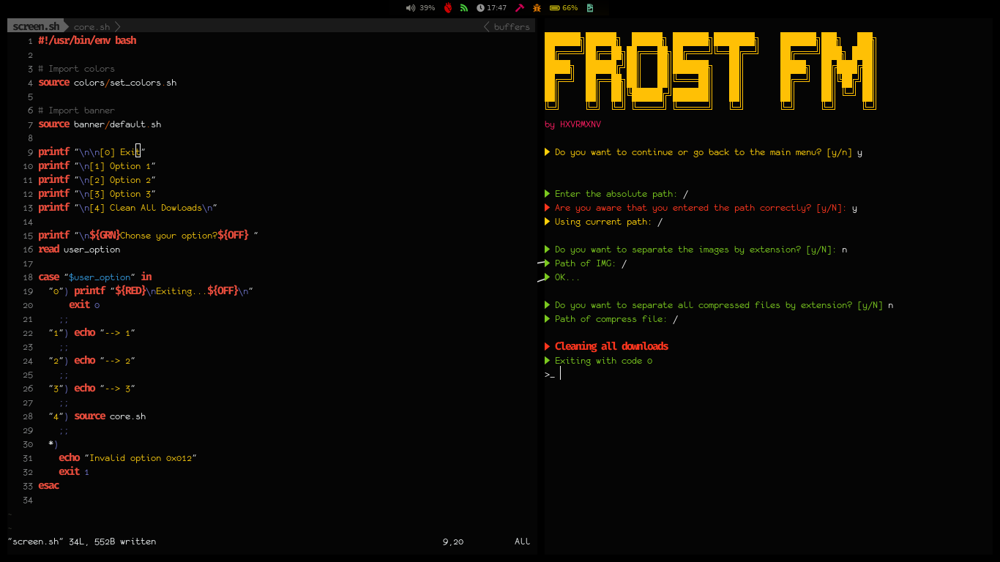
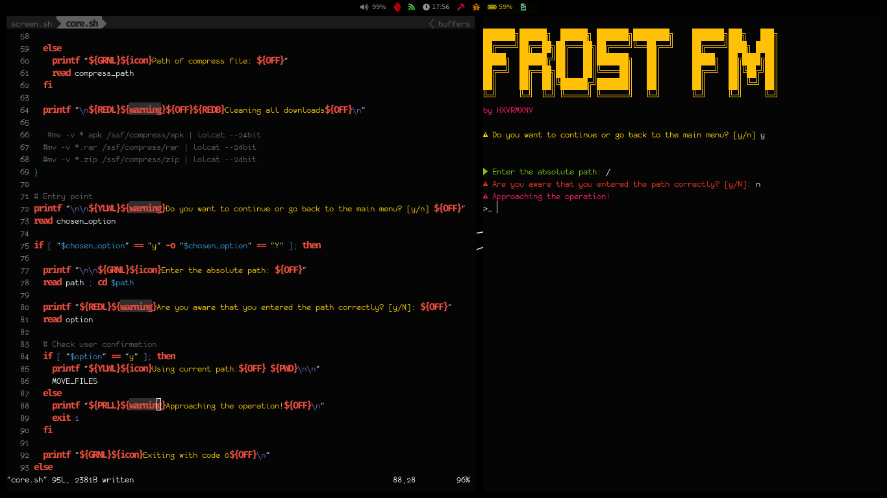

<!-- PROJECT LOGO -->
 

  <h3 align="center">Frost File Manager CLI</h3>
   
Attention this project is still under constant development, this entire guide may be changed.

  

     
    <a href="https://github.com/midnightxd/frost_fm/issues">Report Bug</a>
    ·
    <a href="https://github.com/midnightxd/frost_fm/issues">Request Feature</a>
  

<!-- ABOUT THE PROJECT -->
## About The Project

<!-- GETTING STARTED -->

## Getting Started

#### Prerequisites for frost pkg
`
bash >= 4.4.18
`
`
Nerdfonts
`
#### Manual installation
This project is in the development phase.
